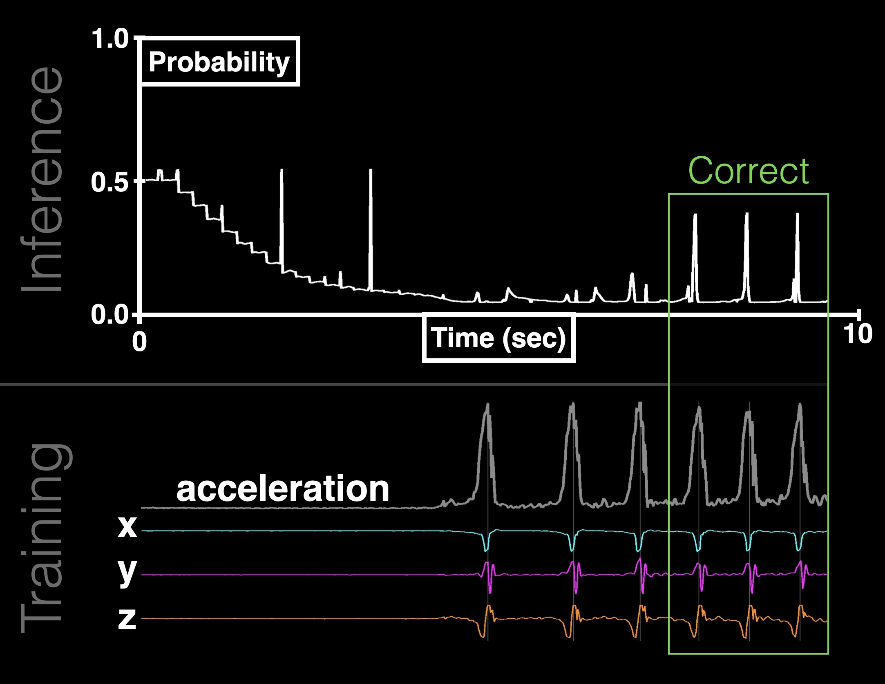

# Step-by-Step: Training IMU-based Gestures with Live Feedback
*Note: This `README` is dedicated to illustrating the basic functions and getting users started. For more complete system details, please refer to the paper in the `docs` directory or review the code in detail.*


**Step-by-Step** is a software tool that allows users to train gesture recognition models on intertial measurement unit (IMU) data with live audiovisual feedback on the neural network's performance as it learns. Step-by-Step is designed to be accessible to users with no machine learning experience while providing a powerful codebase for advanced users. 


*Figure: Live Learning Feedback. The user performs a gesture and receives live feedback on the model’s performance. Bottom Panel: 10 seconds of training data. Acceleration components (x, y, z) are shown in color; magnitude is shown in grey. Each magnitude peak is marked by a thin vertical line, indicating it has been labelled as a gesture in the training data. Top Panel: 10 seconds of inference data. At t = 0 seconds the neural network is completely untrained. Naive to what gestures and non-gestures are, it predicts both with equal probability (p = 0.5). As the model trains on non-gesture data, it begins to predict non-gesture with higher confidence. At t = 5 seconds, the model has converged on a solution that reliably distinguishes non-gestures (p ~ 0). Upon seeing a gesture for the first time, the model is not able to recognize it. After a few demonstrations of the gesture, at t = 10 seconds the model has converged on a solution that reliably distinguishes gestures. Given more training data and time to learn, the model’s performance will continue to improve with gesture and non-gesture probabilities approaching 1 and 0, respectively.*

## Getting Started (Arduino)

### Hardware 
This Python application is set up to receive IMU data via USB connection to a microcontroller. Demonstrations used an Adafruit Feather Huzzah ESP8266 (microcontroller) connected via I2C to an Adafruit BNO-055 (IMU). To set one up yourself you just have to order those 2 components and solder 4 wires to 4 matching pins: 3v3, GND, SCL, and SDA.

### Software
Assuming you are using the recommended hardware, the simplest way to install the example code on the microcontroller is to use the Arduino IDE. You'll need to download Adafruit's libraries for both the microcontroller and the IMU, then use the IDE to install the example script `arduino/imu.ino` onto the microcontorller. There are copious instructions on how to do all of this online.

## Getting Started (Python)

To get started with this Python repository, follow the steps below:

### Prerequisites

Make sure you have the following prerequisites installed on your system:

- Python 3
- pip

### Installation

1. Clone the repository to your local machine:

    ```shell
    git clone https://github.com/michael-schnebly/step-by-step.git
    ```

2. Navigate to the project directory:

    ```shell
    cd step-by-step
    ```


3. Install the required dependencies using pip (preferably in a dedicated virtual environment):

    ```shell
    pip install -r requirements.txt
    ```

### Usage

1. Open the `main.py` file in your preferred Python IDE or text editor.

2. Modify the code as needed to suit your requirements.

3. At minimum, you'll need to identify the serial address of your microcontroller and update that value in main.py.

4. Run the script:

    ```shell
    python main.py
    ```

5. Control the program using keyboard hotkeys:

    - `ESC`: Exiting the application
    - `SPACE`: Pausing or starting the application
    - `1`: Starting or stopping IMU stream
    - `2`: Starting or stopping magnitude plot
    - `M`: Starting or stopping the metronome
    - `3`: Starting or stopping labeling
    - `4`: Starting or stopping neural network inference
    - `5`: Starting or stopping neural network training
